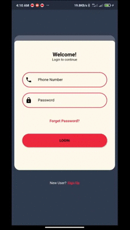

# Chat App

A new Flutter project.

## Getting Started

  - I used Firebase real-time as a database and use Firebase messenger to send notifications and use Firebase storage to save pics of users and used Provider as state management.

  - User when downloading the app, create an account will see a list of his contacts who download the app, user can start to chat with him and another user will get a notification and then click on notification will open the app, user can save all messages and can change his data like his pic or password.

## Video of app
    
  

# use App
  - download code and run it
